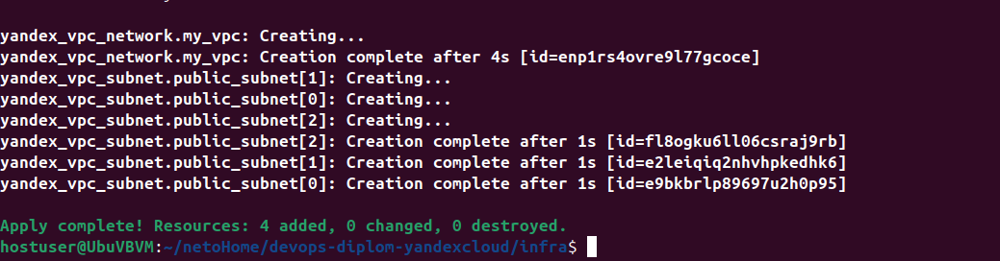
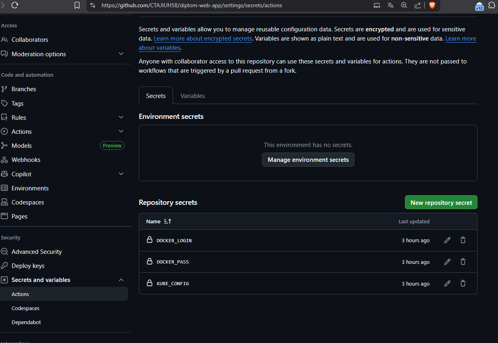
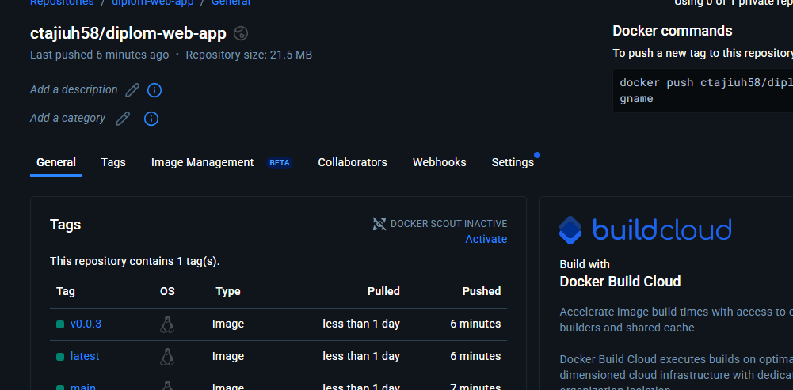

# Дипломный практикум в Yandex.Cloud Ершов Сергей 
  * [Цели:](#цели)
  * [Этапы выполнения:](#этапы-выполнения)
     * [Создание облачной инфраструктуры](#создание-облачной-инфраструктуры)
     * [Создание Kubernetes кластера](#создание-kubernetes-кластера)
     * [Создание тестового приложения](#создание-тестового-приложения)
     * [Подготовка cистемы мониторинга и деплой приложения](#подготовка-cистемы-мониторинга-и-деплой-приложения)
     * [Установка и настройка CI/CD](#установка-и-настройка-cicd)
  * [Что необходимо для сдачи задания?](#что-необходимо-для-сдачи-задания)
  * [Как правильно задавать вопросы дипломному руководителю?](#как-правильно-задавать-вопросы-дипломному-руководителю)

**Перед началом работы над дипломным заданием изучите [Инструкция по экономии облачных ресурсов](https://github.com/netology-code/devops-materials/blob/master/cloudwork.MD).**

---
## Цели:

1. Подготовить облачную инфраструктуру на базе облачного провайдера Яндекс.Облако.
2. Запустить и сконфигурировать Kubernetes кластер.
3. Установить и настроить систему мониторинга.
4. Настроить и автоматизировать сборку тестового приложения с использованием Docker-контейнеров.
5. Настроить CI для автоматической сборки и тестирования.
6. Настроить CD для автоматического развёртывания приложения.

---
## Этапы выполнения:


### Создание облачной инфраструктуры

Для начала необходимо подготовить облачную инфраструктуру в ЯО при помощи [Terraform](https://www.terraform.io/).

Особенности выполнения:

- Бюджет купона ограничен, что следует иметь в виду при проектировании инфраструктуры и использовании ресурсов;
Для облачного k8s используйте региональный мастер(неотказоустойчивый). Для self-hosted k8s минимизируйте ресурсы ВМ и долю ЦПУ. В обоих вариантах используйте прерываемые ВМ для worker nodes.

Предварительная подготовка к установке и запуску Kubernetes кластера.

1. Создайте сервисный аккаунт, который будет в дальнейшем использоваться Terraform для работы с инфраструктурой с необходимыми и достаточными правами. Не стоит использовать права суперпользователя
2. Подготовьте [backend](https://developer.hashicorp.com/terraform/language/backend) для Terraform:  
   а. Рекомендуемый вариант: S3 bucket в созданном ЯО аккаунте(создание бакета через TF)
   б. Альтернативный вариант:  [Terraform Cloud](https://app.terraform.io/)
3. Создайте конфигурацию Terrafrom, используя созданный бакет ранее как бекенд для хранения стейт файла. Конфигурации Terraform для создания сервисного аккаунта и бакета и основной инфраструктуры следует сохранить в разных папках.
4. Создайте VPC с подсетями в разных зонах доступности.
5. Убедитесь, что теперь вы можете выполнить команды `terraform destroy` и `terraform apply` без дополнительных ручных действий.
6. В случае использования [Terraform Cloud](https://app.terraform.io/) в качестве [backend](https://developer.hashicorp.com/terraform/language/backend) убедитесь, что применение изменений успешно проходит, используя web-интерфейс Terraform cloud.

Ожидаемые результаты:

1. Terraform сконфигурирован и создание инфраструктуры посредством Terraform возможно без дополнительных ручных действий, стейт основной конфигурации сохраняется в бакете или Terraform Cloud
2. Полученная конфигурация инфраструктуры является предварительной, поэтому в ходе дальнейшего выполнения задания возможны изменения.


#### Решение


Для подготовки к созданию инфраструктуры создан отдельный каталог [bucket](https://github.com/CTAJIUH58/devops-diplom-yandexcloud/blob/main/bucket/README.md). В манифесте [main.tf](https://github.com/CTAJIUH58/devops-diplom-yandexcloud/blob/main/bucket/main.tf) создаем сервисный аккаунт и назначаем ему необходимые роли:
```
resource "yandex_iam_service_account" "bucket_sa" {
  name        = var.sa_name
}

resource "yandex_resourcemanager_folder_iam_binding" "editor" {
  folder_id  = var.folder_id
  role       = "editor"
  members    = [
    "serviceAccount:${yandex_iam_service_account.bucket_sa.id}"
  ]
  depends_on = [ yandex_iam_service_account.bucket_sa ]
}

resource "yandex_resourcemanager_folder_iam_binding" "storage_admin" {
  folder_id  = var.folder_id
  role       = "storage.admin"
  members    = [
    "serviceAccount:${yandex_iam_service_account.bucket_sa.id}"
  ]
  depends_on = [ yandex_iam_service_account.bucket_sa ]
}
```


Создаем ключ:
```
resource "yandex_iam_service_account_static_access_key" "sa_key" {
  service_account_id = yandex_iam_service_account.bucket_sa.id
}
```


Создаем сам бакет:
```
resource "yandex_storage_bucket" "s3_backend" {
  bucket     = "${var.bucket_name}"
  access_key = yandex_iam_service_account_static_access_key.sa_key.access_key
  secret_key = yandex_iam_service_account_static_access_key.sa_key.secret_key
  acl        = "private"
  force_destroy = true
}
```

Все значения переменных хранятся в файле [variables.tf](https://github.com/CTAJIUH58/devops-diplom-yandexcloud/blob/main/bucket/variables.tf)


Необходимые данные для доступа к бакету получаем из значений output. Добавляю ключи access_key и secret_key в переменные окружения, создаю для основной инфраструктуры отдельный каталог [infra](https://github.com/CTAJIUH58/devops-diplom-yandexcloud/blob/main/infra/README.md).


В файле [providers.tf](https://github.com/CTAJIUH58/devops-diplom-yandexcloud/blob/main/infra/providers.tf) добавлен блок backend "s3" с описанием подключения к бакету в ЯО:
```
terraform {
  required_providers {
    yandex = {
      source = "yandex-cloud/yandex"
    }
  }
  required_version = ">=1.5"

  backend "s3" {
    endpoints =  {
     s3 = "https://storage.yandexcloud.net"
    }
    bucket = "s3backend"
    region = "ru-central1"
    key = "terraform.tfstate"
    skip_region_validation = true
    skip_credentials_validation = true
    skip_requesting_account_id  = true   
    skip_s3_checksum            = true
    use_path_style            = true

  }

}

provider "yandex" {
  cloud_id                 = var.cloud_id
  folder_id                = var.folder_id
  zone                     = var.default_zone
}
```


Выполняю инициализацию с дополнительными аргументами:
```
terraform init -backend-config="access_key=$S3_ACCESS_KEY" -backend-config="secret_key=$S3_SECRET_KEY"
```


Для проверки создаю манифест описывающий подсети в будующем проекте - [subnets.tf](https://github.com/CTAJIUH58/devops-diplom-yandexcloud/blob/main/infra/subnets.tf). Применяю изменения:





И проверяю что файл terraform.tfstate создан в бакете:


Выполняю команду terraform destroy:


И проверяю изменения:


Таким образом мы проверили, что стейт сохраняется в облаке и создание\удаление инфраструктуры не требует дополнительных действий.


---
### Создание Kubernetes кластера

На этом этапе необходимо создать [Kubernetes](https://kubernetes.io/ru/docs/concepts/overview/what-is-kubernetes/) кластер на базе предварительно созданной инфраструктуры.   Требуется обеспечить доступ к ресурсам из Интернета.

Это можно сделать двумя способами:

1. Рекомендуемый вариант: самостоятельная установка Kubernetes кластера.  
   а. При помощи Terraform подготовить как минимум 3 виртуальных машины Compute Cloud для создания Kubernetes-кластера. Тип виртуальной машины следует выбрать самостоятельно с учётом требовании к производительности и стоимости. Если в дальнейшем поймете, что необходимо сменить тип инстанса, используйте Terraform для внесения изменений.  
   б. Подготовить [ansible](https://www.ansible.com/) конфигурации, можно воспользоваться, например [Kubespray](https://kubernetes.io/docs/setup/production-environment/tools/kubespray/)  
   в. Задеплоить Kubernetes на подготовленные ранее инстансы, в случае нехватки каких-либо ресурсов вы всегда можете создать их при помощи Terraform.
2. Альтернативный вариант: воспользуйтесь сервисом [Yandex Managed Service for Kubernetes](https://cloud.yandex.ru/services/managed-kubernetes)  
  а. С помощью terraform resource для [kubernetes](https://registry.terraform.io/providers/yandex-cloud/yandex/latest/docs/resources/kubernetes_cluster) создать **региональный** мастер kubernetes с размещением нод в разных 3 подсетях      
  б. С помощью terraform resource для [kubernetes node group](https://registry.terraform.io/providers/yandex-cloud/yandex/latest/docs/resources/kubernetes_node_group)
  
Ожидаемый результат:

1. Работоспособный Kubernetes кластер.
2. В файле `~/.kube/config` находятся данные для доступа к кластеру.
3. Команда `kubectl get pods --all-namespaces` отрабатывает без ошибок.


#### Решение

Для кубернетис кластера подготавливаю 3 ВМ описанные в файле [k8s.tf](https://github.com/CTAJIUH58/devops-diplom-yandexcloud/blob/main/infra/k8s.tf). Имя пользователя и ssh ключи хранятся в [cloud-conf.yaml](https://github.com/CTAJIUH58/devops-diplom-yandexcloud/blob/main/infra/cloud-conf.yaml).


Переменные для ВМ и сетей описаны в файле [variables.tf](https://github.com/CTAJIUH58/devops-diplom-yandexcloud/blob/main/infra/variables.tf)


Установку и настройку кластера буду выполнять с помощью kubespray. Инвентарный файл будет подготовлен терраформом, формирование инвентарного файла описано в манифесте [k8s_inventory.tf](https://github.com/CTAJIUH58/devops-diplom-yandexcloud/blob/main/infra/k8s_inventory.tf).


Т.к. kubespray использовался мной ранее окружение для его использования уже готово. Создаю папку для новой установки k8s:
```
cp inventory/sample inventory/k8s
```
и копирую в созданную папку сгенерированный терраформом инвентарник [inventory.yaml](https://github.com/CTAJIUH58/devops-diplom-yandexcloud/blob/main/infra/inventory.yaml) и запускаю плейбук:
```
ansible-playbook -i inventory/k8s/inventory.yml cluster.yml -b
```


Копирую конфиг из /inventory/k8s/artifacts/admin.conf в ~/.kube/config и проверяю доступность кластера:


---
### Создание тестового приложения

Для перехода к следующему этапу необходимо подготовить тестовое приложение, эмулирующее основное приложение разрабатываемое вашей компанией.

Способ подготовки:

1. Рекомендуемый вариант:  
   а. Создайте отдельный git репозиторий с простым nginx конфигом, который будет отдавать статические данные.  
   б. Подготовьте Dockerfile для создания образа приложения.  
2. Альтернативный вариант:  
   а. Используйте любой другой код, главное, чтобы был самостоятельно создан Dockerfile.

Ожидаемый результат:

1. Git репозиторий с тестовым приложением и Dockerfile.
2. Регистри с собранным docker image. В качестве регистри может быть DockerHub или [Yandex Container Registry](https://cloud.yandex.ru/services/container-registry), созданный также с помощью terraform.


#### Решение


Создаю [репозиторий](https://github.com/CTAJIUH58/diplom-web-app) на GitHub для тестового приложения на основе Nginx.


[Dockerfile](https://github.com/CTAJIUH58/diplom-web-app/blob/main/Dockerfile) содержит простой код для создания контейнера со статической веб страницей:
```
FROM nginx:alpine
COPY ./index.html /usr/share/nginx/html
EXPOSE 80
```


Собираю приложение и отправляю в DockerHub:
```
docker login -u ctajiuh58
docker build -t ctajiuh58/nginx-test-app:1.0.0 ./
docker push ctajiuh58/diplom-web-app:0.0.1
```


Результат:


Ссылка на образ в [DockerHub](https://hub.docker.com/r/ctajiuh58/diplom-web-app).


---
### Подготовка cистемы мониторинга и деплой приложения

Уже должны быть готовы конфигурации для автоматического создания облачной инфраструктуры и поднятия Kubernetes кластера.  
Теперь необходимо подготовить конфигурационные файлы для настройки нашего Kubernetes кластера.

Цель:
1. Задеплоить в кластер [prometheus](https://prometheus.io/), [grafana](https://grafana.com/), [alertmanager](https://github.com/prometheus/alertmanager), [экспортер](https://github.com/prometheus/node_exporter) основных метрик Kubernetes.
2. Задеплоить тестовое приложение, например, [nginx](https://www.nginx.com/) сервер отдающий статическую страницу.

Способ выполнения:
1. Воспользоваться пакетом [kube-prometheus](https://github.com/prometheus-operator/kube-prometheus), который уже включает в себя [Kubernetes оператор](https://operatorhub.io/) для [grafana](https://grafana.com/), [prometheus](https://prometheus.io/), [alertmanager](https://github.com/prometheus/alertmanager) и [node_exporter](https://github.com/prometheus/node_exporter). Альтернативный вариант - использовать набор helm чартов от [bitnami](https://github.com/bitnami/charts/tree/main/bitnami).

### Деплой инфраструктуры в terraform pipeline

1. Если на первом этапе вы не воспользовались [Terraform Cloud](https://app.terraform.io/), то задеплойте и настройте в кластере [atlantis](https://www.runatlantis.io/) для отслеживания изменений инфраструктуры. Альтернативный вариант 3 задания: вместо Terraform Cloud или atlantis настройте на автоматический запуск и применение конфигурации terraform из вашего git-репозитория в выбранной вами CI-CD системе при любом комите в main ветку. Предоставьте скриншоты работы пайплайна из CI/CD системы.

Ожидаемый результат:
1. Git репозиторий с конфигурационными файлами для настройки Kubernetes.
2. Http доступ на 80 порту к web интерфейсу grafana.
3. Дашборды в grafana отображающие состояние Kubernetes кластера.
4. Http доступ на 80 порту к тестовому приложению.
5. Atlantis или terraform cloud или ci/cd-terraform


#### Решение


Для деплоя мониторинга в кластер буду использовать установленный ранее helm. 


Добавляю репозиторий promtheus в хелм командой:
```
helm repo add prometheus-community https://prometheus-community.github.io/helm-charts
```
и запускаю установку мониторинга:
```
helm install monitoring prometheus-community/kube-prometheus-stack
```


Результат:


Для соблюдения требования о доступности мониторинга и нашего приложения на порту 80 создаю в кластере [ingress](https://github.com/CTAJIUH58/devops-diplom-yandexcloud/blob/main/k8s-conf/ingress.yaml)
```
apiVersion: networking.k8s.io/v1
kind: Ingress
metadata:
  name: diplom-ingress
  namespace: default
  annotations:
    nginx.ingress.kubernetes.io/rewrite-target: /
spec:
  rules:
  - http:
      paths:
      - path: /web-app
        pathType: Prefix
        backend:
          service:
            name: diplom-web-app-svc
            port:
              number: 80      
      - path: /
        pathType: Prefix
        backend:
          service:
            name: monitoring-grafana
            port:
              number: 80
```


Создаю [deployment](https://github.com/CTAJIUH58/devops-diplom-yandexcloud/blob/main/k8s-conf/diplom-web-app.yaml) для приложения:
```
apiVersion: apps/v1
kind: Deployment
metadata:
  name: diplom-web-app
  namespace: default
  labels:
    app: diplom-web-app 
spec:
  replicas: 3
  selector:
    matchLabels:
      app: diplom-web-app
  template:
    metadata:
      labels:
        app: diplom-web-app
    spec:
      containers:
      - name: diplom-web-app
        image: ctajiuh58/diplom-web-app:0.0.1
        ports:
        - containerPort: 80
```
и [службу](https://github.com/CTAJIUH58/devops-diplom-yandexcloud/blob/main/k8s-conf/diplom-web-app-svc.yaml):
```
apiVersion: v1
kind: Service
metadata:
  name: diplom-web-app-svc
  namespace: default
spec:
  selector:
    app: diplom-web-app
  ports:
  - protocol: TCP
    port: 80
    targetPort: 80
  type: ClusterIP
```


Применяю конфиги и проверяю доступность приложения по пути /web-app:


Проверяю доступ к графане по адресу кластера:


Добавляю в графану дашборд 15661 для кубернетис кластера:


---
### Установка и настройка CI/CD

Осталось настроить ci/cd систему для автоматической сборки docker image и деплоя приложения при изменении кода.

Цель:

1. Автоматическая сборка docker образа при коммите в репозиторий с тестовым приложением.
2. Автоматический деплой нового docker образа.

Можно использовать [teamcity](https://www.jetbrains.com/ru-ru/teamcity/), [jenkins](https://www.jenkins.io/), [GitLab CI](https://about.gitlab.com/stages-devops-lifecycle/continuous-integration/) или GitHub Actions.

Ожидаемый результат:

1. Интерфейс ci/cd сервиса доступен по http.
2. При любом коммите в репозиторие с тестовым приложением происходит сборка и отправка в регистр Docker образа.
3. При создании тега (например, v1.0.0) происходит сборка и отправка с соответствующим label в регистри, а также деплой соответствующего Docker образа в кластер Kubernetes.


#### Решение


Для работы пайплайна с нашим кластером и DockerHub необходимо добавить учетные данные для подключения к DockerHub и конфиг k8s.
Добавляю учетные данные и зашифрованный конфиг k8s в хранилище секретов репозитория:





Создаю [workflow](https://github.com/CTAJIUH58/diplom-web-app/blob/main/.github/workflows/cicd.yml) для пайплайна:
```
name: CICD Pipeline

on:
  push:
    branches:
      - main
    tags:
      - 'v*'

jobs:
  build-and-push:
    runs-on: ubuntu-latest
    steps:
      - name: Checkout Code
        uses: actions/checkout@v3

      - name: Set up Docker Buildx
        uses: docker/setup-buildx-action@v2

      - name: Log in to Docker Hub
        uses: docker/login-action@v2
        with:
          username: ${{ secrets.DOCKER_LOGIN }}
          password: ${{ secrets.DOCKER_PASS }}

      - name: Build and Push Docker Image
        uses: docker/build-push-action@v4
        with:
          context: .
          push: true
          tags: |
            ${{ secrets.DOCKER_LOGIN }}/diplom-web-app:latest
            ${{ secrets.DOCKER_LOGIN }}/diplom-web-app:${{ github.ref_name }}

  deploy-to-kubernetes:
    runs-on: ubuntu-latest
    needs: build-and-push
    if: startsWith(github.ref, 'refs/tags/v')
    steps:
      - name: Checkout Code
        uses: actions/checkout@v3

      - name: Set up kubectl
        uses: azure/setup-kubectl@v3
        with:
          version: 'latest'

      - name: Configure Kubernetes Context
        run: |
          echo "${{ secrets.KUBE_CONFIG }}" | base64 -d > kubeconfig
          export KUBECONFIG=kubeconfig

      - name: Deploy to Kubernetes
        run: |
          export KUBECONFIG=kubeconfig
          kubectl --kubeconfig=kubeconfig apply -f k8s-conf/diplom-web-app.yaml
          kubectl --kubeconfig=kubeconfig apply -f k8s-conf/diplom-web-app-svc.yaml
          kubectl --kubeconfig=kubeconfig rollout status deployment/diplom-web-app
```

Пайплайн будет обновлять образ в DockerHub и если есть метка тега - обновлять приложение в кластере.


Делаю коммит без тега и пуш в репозиторий, пайплайн пропускает шаг обновления в k8s:


Но делает новый билд и отправляет в DockerHub:


Делаю коммит с тегом 0.0.3 и пуш в репозиторий, пайплайн подключается к кластеру и обновляет наше приложение:


А так же обновляет образ в докере с тегом версии:





Проверяем изменения в приложении по адресу кластера:


---
## Что необходимо для сдачи задания?

1. Репозиторий с конфигурационными файлами Terraform и готовность продемонстрировать создание всех ресурсов с нуля.
2. Пример pull request с комментариями созданными atlantis'ом или снимки экрана из Terraform Cloud или вашего CI-CD-terraform pipeline.
3. Репозиторий с конфигурацией ansible, если был выбран способ создания Kubernetes кластера при помощи ansible.
4. Репозиторий с Dockerfile тестового приложения и ссылка на собранный docker image.
5. Репозиторий с конфигурацией Kubernetes кластера.
6. Ссылка на тестовое приложение и веб интерфейс Grafana с данными доступа.
7. Все репозитории рекомендуется хранить на одном ресурсе (github, gitlab)

